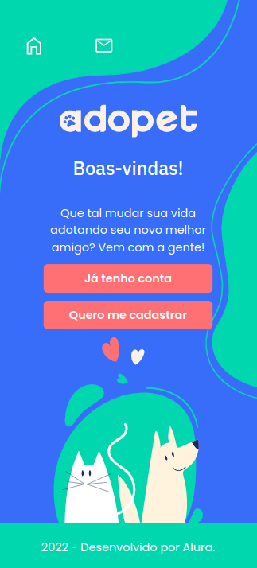
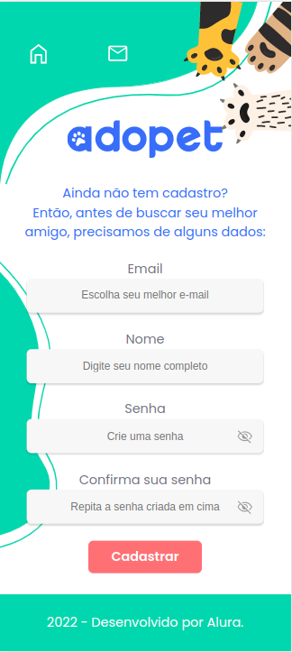

# Adopet
||
---------------------------------------------------------------------|

[https://jeisonsilva.github.io/adopet](https://jeisonsilva.github.io/adopet)

Este projeto tem por objetivo a criação de uma vitríne de cãezinhos para adoção onde podemos incentivar futuros amigos a se descobrirem.

## Estrutura do projeto
Adopet é uma plataforma para unir pessoas e câes! e para melhorar essa pesquisa solicitamos a identificação do usuário. Depois da criação do perfil e login disponibilizamos uma lista de amiginhos para adoção onde poderá escolher o seu futuro perceiro. Depois disto a próxima etapa é nos enviar uma mensagem com os dados para contato, pois desta forma combinaremos o processo da adoção. Claro! este processo é tudo dentro de nossa plataforma!!!

## Imagens da plataforma

|Login|Cadastro
|-----|--------|
||

## Autor
*Jeison O. da Silva*

Programador Backend utilizando tecnologias microsoft e agora FrontEnd